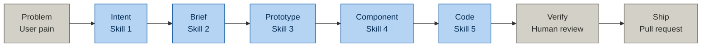

@AGENTS.md

# CLAUDE.md — Capella Frontend · Intent-Driven Development
**Version:** 2.3 — added a §Pipeline overview diagram, no behavior change

> This file is read automatically by Claude Code at the start of every session.
> It is the source of truth for how Claude Code reads, generates, and modifies
> code in this repo. Do not delete or move this file.
>
> What changed vs v2.2, and why:
> - Added a Mermaid flowchart under "Pipeline overview" showing all 8 stages
>   (Problem → Intent → Brief → Prototype → Component → Code → Verify → Ship)
>   at a glance, before the command-by-command detail. Doc only, no behavior
>   change.
>
> What changed vs v2.1, and why:
> - `/idd-mock` is renamed to `/idd-ui-component` (Skill 4, unchanged behavior) —
>   "mock" was accurate for the old throwaway-HTML version (pre-v2.0), but this
>   skill has generated real, production-primitive components since v2.0. Now
>   that `/idd-prototype` (Skill 3) owns the actual throwaway-mock job, keeping
>   "mock" in this skill's name was actively misleading about what it produces.
> - `skill-4-ui-mock/` directory renamed to `skill-4-ui-component/`.
>
> What changed vs v2.0, and why:
> - New `/idd-prototype` command (Skill 3) — a fast, throwaway HTML/CSS mock for
>   early shape iteration with PM/Designer/UX, cheap to fully redo. Restored
>   because the real-component skill (`/idd-ui-component`, now Skill 4) fixed
>   late DS-fidelity bugs but made early shape exploration more expensive — a
>   real typed component is a heavier thing to throw away than a sketch.
> - `/idd-ui-component` is now Skill 4 (was Skill 3) — unchanged behavior, it
>   still generates real presentational components + Storybook stories, but
>   now assumes Skill 3 already settled the screen's shape.
> - `/idd-code` is now Skill 5 (was Skill 4) — unchanged behavior.
> - §9 repo structure updated for the new `skill-3-prototype/` directory and the
>   renumbered `skill-4-ui-component/` / `skill-5-code-generator/` directories.
>
> What changed vs v1.2, and why (still true):
> - §2 checklist items now point at real files (design system lives in a shared npm
>   package, not local files; there is no local `Button.tsx`/`Modal.tsx`).
> - §4 RBAC section corrected: this repo does not use `disabled` vs. absent alone as
>   the marker — it also has a real `usePermissions()` hook that is the dominant
>   gating mechanism, and the role model has 3 org-level + 5 project-level roles
>   (not "four roles"), with camelCase literal values, not kebab-case.
> - §5 design system rules now name the real CSS variable families and the real
>   Tailwind spacing alias scale.
> - §9 repo structure fixed to match what's actually on disk.

---

## Pipeline overview



Gray stages (Problem, Verify, Ship) are human touchpoints, not slash commands.
The five middle stages map 1:1 to the slash commands below.

---

## Slash commands

These commands are available in every Claude Code session in this repo.
Type them exactly as shown.

### `/idd-intent [feature-seed]`
Run IDD Skill 1: Intent Builder for a new feature.
Reads: docs/capella-ds-index.json, docs/capella-core-ia.md, docs/capella-core-url-map.md
Output: intent-[feature-slug]-v1.0.md in docs/intents/active/
Example: `/idd-intent "users cannot tell if their backup is configured"`

### `/idd-brief [intent-filename]`
Run IDD Skill 2: Design Brief for the named intent statement.
Reads: intent statement from docs/intents/active/
Output: 6-section design brief printed in chat for PM to assemble
Example: `/idd-brief intent-backup-restore-v1.1.md`

### `/idd-prototype [intent-filename] [screen-name]`
Run IDD Skill 3: Prototype for the named screen(s) — a fast, throwaway,
self-contained HTML/CSS mock, not real code. Reads: intent statement +
design brief if one exists + docs/capella-ds-index.json for real token
values to hand-copy. Output: mock-[feature-slug]-v[n]-[screen].html in
docs/mocks/ — a `.mock-controls` role switcher covers RBAC states, no build
step needed. Cheap to fully redo; this is where PM/Designer/UX settle the
screen's shape before any real code exists.
Example: `/idd-prototype intent-backup-restore-v1.1.md cluster-backups`

### `/idd-ui-component [intent-filename] [component-name]`
Run IDD Skill 4: UI Component for the named screen/component, once its shape is
settled (via `/idd-prototype` or a design brief).
Reads: intent statement + grounding files + the existing sibling component(s) under src/pages/**
Output: the real presentational `.tsx`
component plus a co-located `.stories.tsx` file, using real
`@couchbasecloud/ui-platform` primitives and this repo's real fixture
utilities (`mocks/permission`, `mocks/utils/wrap-with-rbac`). Reviewed by
running `npm run storybook:watch`. No filename versioning — edited in place;
git diff is the change history.
Example: `/idd-ui-component intent-backup-restore-v1.1.md cluster-backups`

### `/idd-code [intent-filename]`
Run IDD Skill 5: Code Generator for the named intent statement.
Reads: intent statement + source files in this repo
Output: typed React/TS components + gap report + tasks.md
Example: `/idd-code intent-backup-restore-v1.2.md`
(tasks.md is generated as part of this step — no separate command for it.)

### `/idd-archive [feature-slug]`
Archive a completed feature.
Moves: docs/intents/active/intent-[feature-slug]-*.md
    → docs/intents/archive/[YYYY-MM-DD]-[feature-slug]/
Updates: docs/capella-core-url-map.md if new routes were added
Prints: archive summary and any open questions that remain unresolved
Example: `/idd-archive backup-restore`

### `/idd-status`
Show the current state of all active features.
Reads: docs/intents/active/ directory
Output: table of feature | intent version | open questions count | tasks status

---

## 1 — What you are doing

You are implementing a Couchbase Capella UI feature defined in an intent statement.
Find the active intent statements at: `docs/intents/active/`

Read the intent statement before touching any code.
The intent statement tells you what to build, what the RBAC rules are,
what the scale constraints are, and where the feature boundary is.

---

## 2 — Session start checklist (mandatory — complete before writing any code)

- [ ] Find and read the intent statement in `docs/intents/active/`
- [ ] Find the existing page/component for the screen being extended (`src/pages/**`)
- [ ] Design tokens, Button, and Dialog/ConfirmDialog come from the shared npm
      package **`@couchbasecloud/ui-platform`** (`node_modules/@couchbasecloud/ui-platform/dist/`)
      — there is no local `Button.tsx`/`Modal.tsx`/`tokens.css`. Import from the
      package; do not create local duplicates.
- [ ] Note there is no component literally named `Modal` — use `Dialog` for general
      modals and `ConfirmDialog` for confirm/destructive flows (both from
      `@couchbasecloud/ui-platform`).
- [ ] Find and read `src/constants/roles.ts` — note the exact role string values
      (camelCase keys, see §4 below — not kebab-case).
- [ ] Find and read `src/hooks/use-permissions/use-permissions.ts` — the actual RBAC
      gating mechanism used by most feature code (`canRead`/`canCreate`/`canUpdate`/`canDelete`).
- [ ] Confirm which routes exist in `src/routing/definitions/<domain>.tsx` — see
      `docs/capella-core-url-map.md` for the current full map.
- [ ] Find the existing API service for this domain under `src/sync/<domain>-service/`
      — note endpoint patterns and `*.types.ts` for existing type definitions.
- [ ] Identify the layout template for the screen being extended — Template A
      (cluster-context shell: `AppBar` + `BreadCrumbsNav` + `Screen`+tab nav) vs.
      Template B (`LayoutSettings` sidebar) vs. chrome-less (setup wizard). See
      `docs/capella-core-ia.md`.

Report what you found for each item before generating any code.
If something is missing, flag it as a gap — do not invent it.

---

## 3 — What to build

Read §Navigation model and §Scope from the intent statement.
Generate the components described there.
Match the naming convention of existing components in the codebase.

After generating all components, generate tasks.md using the template at:
docs/idd-skills/skill-5-code-generator/tasks-template.md

Fill in every placeholder with feature-specific content from:
- §Scope → component tasks
- §Constraints → RBAC, destructive guard, scale, dangerous defaults
- Gap report → gap resolution tasks

---

## 4 — RBAC rules (non-negotiable for Capella)

Read §Who/RBAC from the intent statement for the experience per role.

**Real role model** (from `src/constants/roles.ts` — camelCase literal keys, not
kebab-case, and 3 + 5 roles, not "four"):

```ts
// Organization-level (3)
type OrganizationRole = 'organizationOwner' | 'projectCreator' | 'organizationMember';

// Project-level (5)
type ProjectRole =
  | 'projectOwner'
  | 'projectClusterManager'
  | 'projectClusterViewer'
  | 'projectDataWriter'
  | 'projectDataViewer';
```
A separate, unrelated free-form custom-roles system exists for App Services /
database access-control roles (`src/utils/instance-settings/privileges.ts`,
`src/pages/database/settings/access-control/roles/`) — those are user-defined
name+privileges, not this fixed enum. Don't conflate the two when an intent
statement says "roles."

**Two gating mechanisms exist — prefer the first for anything backed by a server
permission check:**

```tsx
// PREFERRED — server-computed CRUD permission gating (dominant pattern in this repo)
import { usePermissions } from 'hooks/use-permissions/use-permissions';

const { canRead, canCreate, canUpdate, canDelete } = usePermissions(permissions);
{canDelete && <Button variant="danger">Delete</Button>}

// ALSO VALID — direct role-string check, for role-specific branching
// (e.g. src/utils/organization/organization.ts: isOrganizationOwner)
const canManage = organizationRoles.includes('organizationOwner');
{canManage && <Button variant="primary">Action</Button>}
```

Excluded controls: ABSENT (conditional render) — not DISABLED.

```tsx
// WRONG — never use disabled for access control in Capella
<Button disabled={!canManage}>Action</Button>
```

---

## 5 — Design system rules

All tokens/components come from `@couchbasecloud/ui-platform` (see
`docs/capella-ds-index.json` for the full extracted index).

- **Colors**: use the real `--color-*`/`--outline-*` CSS variables via their Tailwind
  class mappings (e.g. `bg-primary`, `text-on-background`, `border-on-danger`).
  Never hardcode hex.
- **Spacing**: use the Tailwind alias scale (`xxs`…`8xl`, `gutter`, `gutter-sm`,
  `gutter-lg`, `gutter-2x`) — e.g. `p-md`, `gap-xl`, `m-3xl`. Never use raw numeric
  Tailwind spacing classes (enforced by `eslint-plugin-custom-rules/use-spacing-tokens`).
- **Typography**: use the `--display-*`/`--heading-*`/`--text-t{2-5}-{weight}` font
  shorthand variables — not `--font-*`.
- **Button**: import `Button` from `@couchbasecloud/ui-platform`; pick a variant from
  the real `DefaultButtonVariant`/`SlimButtonVariant`/`IconOnlyButtonVariant` unions
  (see docs/capella-ds-index.json) — do not invent a variant name.
- **Modal/confirm flows**: import `Dialog` or `ConfirmDialog` from
  `@couchbasecloud/ui-platform`. For "type entity name to confirm" destructive
  flows, use `ConfirmDialog`'s `confirmationValue` + `isCaseSensitive` props.

Match the exact className / Tailwind pattern in existing components. Match the
density of the existing screen being extended.

---

## 6 — Interaction rules (always apply to any Capella feature)

**Destructive actions (delete, rotate, restore):**
- Always require a typed confirmation modal — use `ConfirmDialog` with
  `confirmationValue` set to the entity name and `isCaseSensitive` as appropriate
- Confirm button disabled until input matches entity name exactly
- Never closes on backdrop click (`ConfirmDialog`'s `enableOutsideClickClose` should
  be left `false`/unset for destructive flows)
- Always shows downstream impact summary (use `contentAboveWarning`/`contentBelowWarning`)

**Async states (always include all four):**
- Loading: skeleton rows/cards
- Success: toast notification
- Error: inline error with retry
- Empty: empty state with appropriate CTA per role

---

## 7 — Output format (required on every generated file)

Header comment on every file:
```tsx
/**
 * [ComponentName]
 * Intent: [intent filename] §[section]
 * Route:  [route from intent §Navigation model]
 * RBAC:   [roles that see this component]
 */
```

After all components:
1. State transitions table: Action | Result | Condition
2. Gap report: Item | Status | Action needed
3. tasks.md — filled from template, saved to feature directory

---

## 8 — What NOT to do

- Do not hardcode hex colors
- Do not use `any` types
- Do not use `disabled` for access control
- Do not modify existing files (generate new files only)
- Do not invent API endpoints (flag as gaps)
- Do not invent Button/Dialog variant names — use the real unions in
  `docs/capella-ds-index.json`
- Do not create a local `Button`/`Modal`/`tokens.css` — they already exist in
  `@couchbasecloud/ui-platform`
- Do not commit, push, or create branches unless explicitly asked
- Do not add npm packages without flagging first

---

## 9 — Repo structure for IDD artifacts

```
docs/
├── capella-ds-index.json                ← design tokens / component prop index
├── capella-core-ia.md                   ← layout template patterns
├── capella-core-url-map.md              ← full route map
├── intents/
│   ├── active/                          ← current features in flight
│   │   └── intent-[feature-slug]-v1.0.md  ← v1.0 for a new feature; increments per feature's own history
│   └── archive/                         ← shipped features (empty until first archive)
├── mocks/                                ← Skill 3 throwaway HTML prototypes
└── idd-skills/                          ← skill definitions
    ├── IDD-SKILLS-INDEX.md
    ├── skill-1-intent-builder/SKILL.md
    ├── skill-2-design-brief/SKILL.md
    ├── skill-3-prototype/SKILL.md
    ├── skill-4-ui-component/SKILL.md
    └── skill-5-code-generator/
        ├── SKILL.md
        └── tasks-template.md
```

Real source locations referenced throughout this file:
- Design system: `node_modules/@couchbasecloud/ui-platform/dist/` (package pinned in `package.json`)
- Router: `src/routing/routes.tsx`, `src/routing/definitions/*.tsx`
- Layouts: `src/layouts/layout-*/`
- Auth/roles: `src/constants/roles.ts`, `src/hooks/use-permissions/use-permissions.ts`, `src/contexts/auth.context.tsx`
- Pages: `src/pages/<domain>/...`
- API services: `src/sync/<domain>-service/`

---

## 10 — Archive pattern

When a feature ships and is merged to main, run `/idd-archive [feature-slug]`.

This will:
1. Move intent from docs/intents/active/ → docs/intents/archive/[YYYY-MM-DD]-[slug]/
2. Move tasks.md into the same archive folder
3. Check docs/capella-core-url-map.md — prompt to add any new routes from the feature
4. Print a summary of any open questions that were never resolved

The PR description for the feature must include:
```
Intent: docs/intents/archive/[date]-[slug]/intent-[slug]-v[n].md
```

This makes every PR traceable back to the intent statement that drove it.
